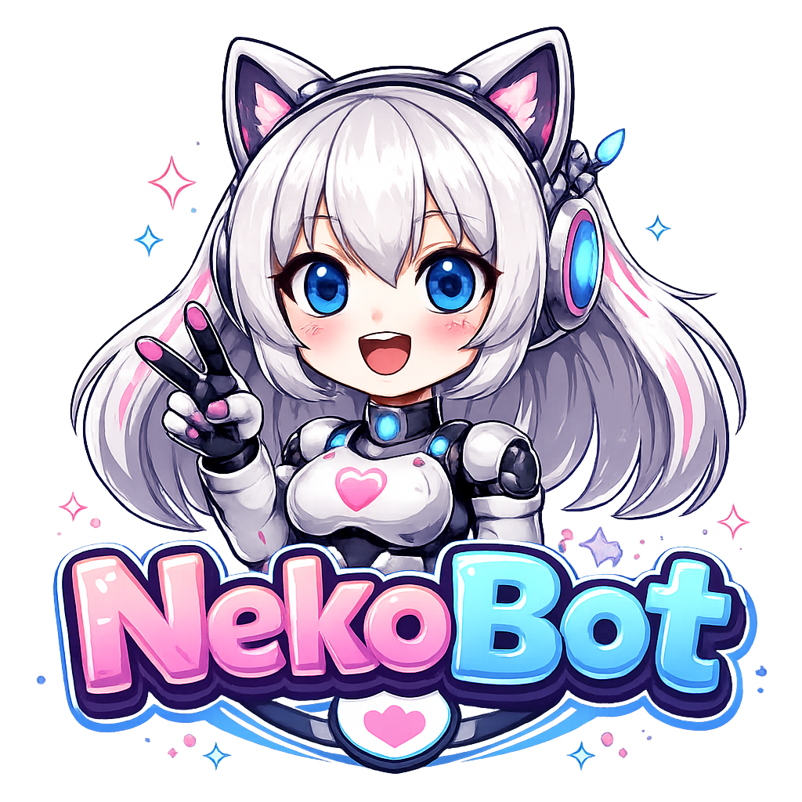

# NekoBot





A prefix-based Discord bot written in TypeScript (discord.js v14) with music playback, moderation and EN/ID language support.

## Commands

Default prefix is `!` (change it per server with `!prefix <new>`).

**General**
- [+] `ping`: bot latency
- [+] `prefix` (`setprefix`): change the server prefix
- [-] `help`

**Music**
- [+] `play` (`p`): song name, video URL or playlist URL
- [+] `pause`, `resume`, `skip` (`s`), `stop`
- [+] `queue` (`q`), `nowplaying` (`np`)
- [+] `loop [off|track|queue]`, `shuffle`, `remove <n>`
- [+] `join` (`j`), `leave` (`l`)

Playlists and YouTube mixes: `!play <playlist link>` queues up to 50 songs. 
A link that has both a video and a list (`watch?v=...&list=...`) plays only the video; add `--playlist` to load the whole list. 
"Play mix" links (`start_radio=1`) are loaded as a list automatically.

## Setup

Requirements: 
Node.js
[yt-dlp](https://github.com/yt-dlp/yt-dlp) for music (ffmpeg is bundled through `ffmpeg-static`).


```bash
npm install
```

Create a `.env` file:

```env
DISCORD_TOKEN=your-bot-token
PREFIX=!
OWNER_ID=your-user-id

# Optional
# YTDLP_PATH=D:\DIY\NekoBot\lib\yt-dlp.exe
# MAX_PLAYLIST=50
```

If `yt-dlp` is not on your PATH, set `YTDLP_PATH` to the executable. 
Keep yt-dlp updated (`yt-dlp -U`), since YouTube changes often.

## Run

```bash
npm run dev     # development (ts-node, watch mode)
npm run build   # compile to dist/ and copy locale/database JSON files
npm start       # run the compiled bot
```

The bot leaves the voice channel 3 minutes after the queue ends.

## License

[MIT](https://github.com/estjava/NekoBot#MIT-1-ov-file)